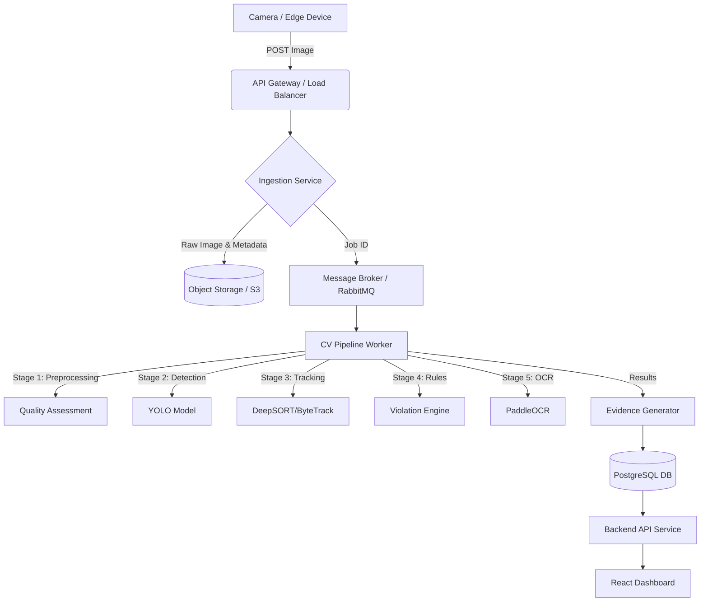

# System Architecture

## 1. High-Level Architecture Overview
TrafficVision AI follows a microservices-based, event-driven architecture designed for high throughput and horizontal scalability.

### Data Flow Diagram


## 2. Component Responsibilities
- **Ingestion Service**: Exposes REST APIs to receive images from cameras. Validates payloads, saves raw images to Object Storage, and queues processing jobs.
- **Message Broker (RabbitMQ/Kafka)**: Buffers incoming requests to prevent overwhelming the AI inference nodes during traffic spikes.
- **CV Pipeline Worker**: A GPU-accelerated service (Python/PyTorch) that consumes jobs from the queue and runs the AI models sequentially.
- **Evidence Generator**: Compiles cropped bounding boxes, metadata, and timestamps into a verified "Violation Record" and persists it.
- **Backend API (FastAPI)**: Serves data to the frontend, handling authentication, pagination, and analytics aggregations.
- **Frontend Dashboard (React)**: User interface for reviewing violations and viewing analytics.

## 3. Docker Layout
```text
/trafficvision
├── docker-compose.yml
├── /frontend          # React + TypeScript + Vite
├── /backend           # FastAPI + SQLAlchemy
├── /cv-pipeline       # PyTorch + Celery Worker
├── /db                # PostgreSQL + PostGIS (Optional)
└── /broker            # RabbitMQ / Redis
```

## 4. Horizontal Scaling Strategy
- **Stateless Workers**: The CV Pipeline Workers are entirely stateless. They can be scaled horizontally across multiple GPU instances.
- **Message Queuing**: As load increases, the queue depth will trigger auto-scaling groups to spin up new worker nodes.
- **Database Partitioning**: The Violations table will be partitioned by date (e.g., monthly) to ensure fast query times on historical data.
